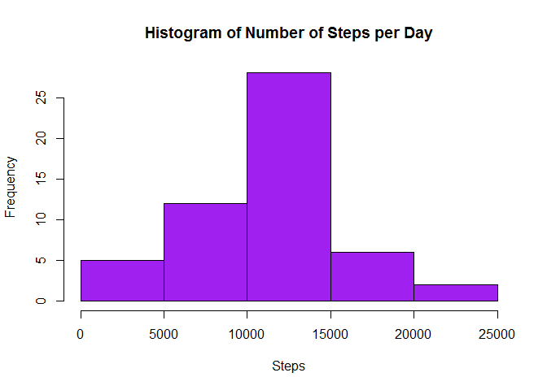
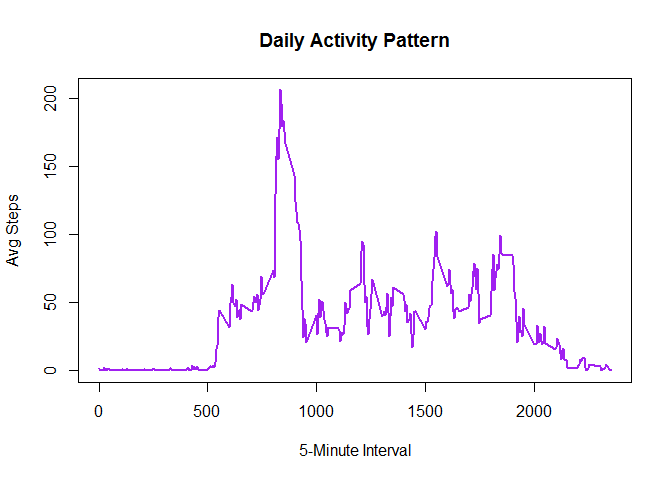
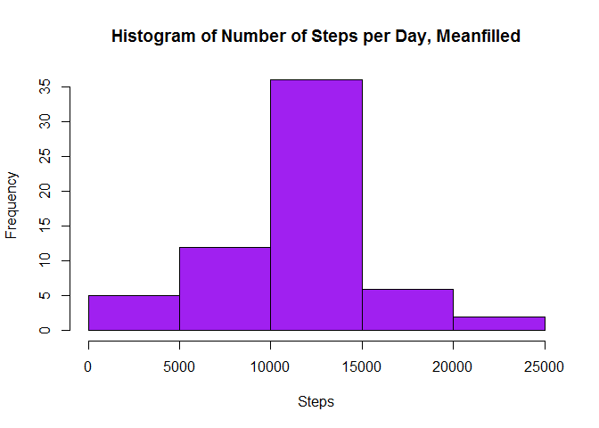
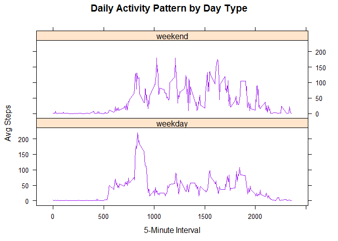

# Reproducible Research - Project 1
Kristeen Kratz  
April 2, 2016  

##Loading and preprocessing the data


```r
rawdata<-read.csv(file="activity.csv",header=TRUE, sep=",",colClasses = c("numeric", "Date", "numeric"))
head(rawdata)
```

```
##   steps       date interval
## 1    NA 2012-10-01        0
## 2    NA 2012-10-01        5
## 3    NA 2012-10-01       10
## 4    NA 2012-10-01       15
## 5    NA 2012-10-01       20
## 6    NA 2012-10-01       25
```

##What is mean total number of steps taken per day?


```r
byDay<-aggregate(x=rawdata["steps"], by=list(Date=rawdata$date),FUN=sum)
hist(byDay$steps, main="Histogram of Number of Steps per Day", xlab="Steps",col="purple")
```



```r
MeanSteps<-mean(byDay$steps,na.rm=TRUE)
MedianSteps<-median(byDay$steps,na.rm=TRUE)
avgSteps<-data.frame(cbind(MeanSteps,MedianSteps))
avgSteps
```

```
##   MeanSteps MedianSteps
## 1  10766.19       10765
```

##What is the average daily activity pattern?


```r
byInterval<-aggregate(x=rawdata["steps"], by=list(Interval=rawdata$interval),FUN=mean, na.rm=TRUE)
plot(byInterval$Interval,byInterval$steps,type="l",main="Daily Activity Pattern", xlab="5-Minute Interval", ylab="Avg Steps",col="purple",lwd=2)
```



Which 5-minute interval, on average across all the days in the dataset, contains the maximum number of steps?


```r
maxInterval<-subset(byInterval,steps==max(steps, na.rm=TRUE))
maxInterval
```

```
##     Interval    steps
## 104      835 206.1698
```

##Imputing missing values

```r
summary(rawdata)
```

```
##      steps             date               interval     
##  Min.   :  0.00   Min.   :2012-10-01   Min.   :   0.0  
##  1st Qu.:  0.00   1st Qu.:2012-10-16   1st Qu.: 588.8  
##  Median :  0.00   Median :2012-10-31   Median :1177.5  
##  Mean   : 37.38   Mean   :2012-10-31   Mean   :1177.5  
##  3rd Qu.: 12.00   3rd Qu.:2012-11-15   3rd Qu.:1766.2  
##  Max.   :806.00   Max.   :2012-11-30   Max.   :2355.0  
##  NA's   :2304
```

```r
stepsNA<-sum(is.na(rawdata$steps))
```
There are 2304 missing values we need to fill in.  We will do so by replacing them with the Interval mean.


```r
library(zoo)
```

```
## 
## Attaching package: 'zoo'
```

```
## The following objects are masked from 'package:base':
## 
##     as.Date, as.Date.numeric
```

```r
filledSteps<-na.aggregate(rawdata$steps,by=rawdata$interval,FUN=mean)
newData<-subset(rawdata,select=c("interval","date"))
newData$steps<-filledSteps
head(newData)
```

```
##   interval       date     steps
## 1        0 2012-10-01 1.7169811
## 2        5 2012-10-01 0.3396226
## 3       10 2012-10-01 0.1320755
## 4       15 2012-10-01 0.1509434
## 5       20 2012-10-01 0.0754717
## 6       25 2012-10-01 2.0943396
```

Let's take a look at how this impacted our mean and median values above:


```r
byDayNew<-aggregate(x=newData["steps"], by=list(Date=newData$date),FUN=sum)
hist(byDayNew$steps, main="Histogram of Number of Steps per Day, Meanfilled", xlab="Steps",col="purple")
```



```r
MeanStepsNew<-mean(byDayNew$steps,na.rm=TRUE)
MedianStepsNew<-median(byDayNew$steps,na.rm=TRUE)
avgStepsNew<-data.frame(cbind(MeanStepsNew,MedianStepsNew))
avgStepsNew
```

```
##   MeanStepsNew MedianStepsNew
## 1     10766.19       10766.19
```
Not much impact.

##Are there differences in activity patterns between weekdays and weekends?

```r
newData$dayFlag<-ifelse(weekdays(newData$date) %in% c("Satuday", "Sunday"), "weekend", "weekday")
head(newData)
```

```
##   interval       date     steps dayFlag
## 1        0 2012-10-01 1.7169811 weekday
## 2        5 2012-10-01 0.3396226 weekday
## 3       10 2012-10-01 0.1320755 weekday
## 4       15 2012-10-01 0.1509434 weekday
## 5       20 2012-10-01 0.0754717 weekday
## 6       25 2012-10-01 2.0943396 weekday
```

```r
byIntervalNew<-aggregate(x=newData["steps"], by=list(Interval=newData$interval,dayFlag=newData$dayFlag),FUN=mean, na.rm=TRUE)
library(lattice)
xyplot(steps ~ Interval | dayFlag, byIntervalNew, type = "l", layout = c(1, 2), 
       main="Daily Activity Pattern by Day Type", xlab="5-Minute Interval", ylab="Avg Steps", col="Purple")
```



##Answer??  ABSOLUTELY!
